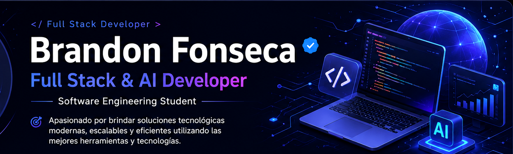
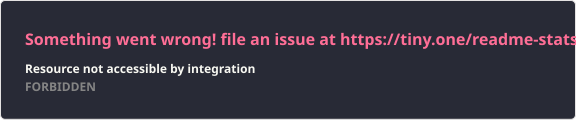

  

 

 

  

---

---

<h2 align="center">Sobre mí</h2>

  

  Soy estudiante de <strong>Ingeniería de Software en la ESPE</strong>, enfocado en el desarrollo
  de aplicaciones modernas, escalables y orientadas a resolver problemas reales.

 

<table>
  <tr>
    <td width="50%" valign="top">

### Perfil profesional

Me desarrollo como **Full Stack Developer**, trabajando tanto en la lógica del backend como en la creación de interfaces web y móviles.

Tengo experiencia construyendo **APIs REST**, gestionando bases de datos, diseñando arquitecturas de software y desplegando aplicaciones mediante contenedores.

También aplico conocimientos de **Inteligencia Artificial** para integrar modelos, automatizar procesos y desarrollar herramientas inteligentes.

</td>
    <td width="50%" valign="top">

### Enfoque actual

- Desarrollo Full Stack
- Aplicaciones web y móviles
- Integración de Inteligencia Artificial
- Arquitecturas de microservicios
- APIs REST y servicios backend
- Bases de datos SQL y NoSQL
- Docker, despliegue y automatización
- Buenas prácticas y calidad de software

</td>
  </tr>
</table>

 

  
  
  
  

  Me mantengo actualizado con nuevas tecnologías, frameworks y tendencias de desarrollo,
  buscando aplicar cada aprendizaje en proyectos reales y soluciones innovadoras.

---

---

## 📊 Estadísticas de GitHub

  
  

  

---

## 📈 Actividad en GitHub

  

---

## 🛠️ Tecnologías y herramientas

### Lenguajes de programación

  

### Backend y frameworks

  

### Frontend y desarrollo móvil

  

### Bases de datos

  

### DevOps y herramientas

  

---

## 🚀 Áreas de especialización

| Área | Área | Área | Área |
|---|---|---|---|
| 💻 **Full Stack** | 🤖 **Inteligencia Artificial** | ⚙️ **Backend** | 🎨 **Frontend** |
| 📱 **Aplicaciones móviles** | 🔗 **APIs REST** | 🏗️ **Microservicios** | 🐳 **Docker** |
| 🗄️ **Bases de datos** | ☁️ **Cloud Computing** | 🔐 **Seguridad** | 🚀 **Despliegue** |

---

## 🚀 Proyectos destacados

| Proyecto | Descripción | Tecnologías |
|---|---|---|
| 🛡️ **SAVIA-EV** | Sistema diseñado para monitorear la integridad durante evaluaciones virtuales. | Java · Spring Boot · IA |
| 📊 **AnalytiCore** | Plataforma inteligente para el análisis y procesamiento de texto. | Java · Spring Boot |
| 🥗 **DK-FITT Backend** | API para evaluaciones clínicas, planes nutricionales y control calórico. | Node.js · TypeScript · PostgreSQL |
| 🏗️ **Sistema de Microservicios** | Sistema distribuido para gestionar solicitudes, técnicos, inventario y procesos. | FastAPI · RabbitMQ · Docker · React |
| 📱 **Drink-Go** | Aplicación móvil multiplataforma con una interfaz moderna e intuitiva. | Flutter · Dart |
| 🐾 **PetCare Control Web** | Plataforma web para la gestión y administración del cuidado de mascotas. | Laravel · MySQL |

---

## 🌱 En constante aprendizaje

- 🤖 Inteligencia Artificial y modelos generativos
- 🧠 Machine Learning
- 🏗️ Arquitecturas de microservicios
- ☁️ Cloud Computing
- ⚛️ React y desarrollo frontend moderno
- 📱 Flutter y desarrollo multiplataforma
- 🐳 Docker y contenedores
- 🚀 DevOps e integración continua
- 🔐 Seguridad en aplicaciones y APIs
- 🧪 Pruebas y calidad de software

---

## 🐍 Contribuciones

  

---

## 📫 Conecta conmigo

  

---

## 💡 Filosofía

  <strong>
    “La tecnología evoluciona todos los días; por eso mi objetivo es aprender constantemente,
    mantenerme actualizado y desarrollar soluciones innovadoras mediante Inteligencia Artificial
    y Desarrollo Full Stack.”
  </strong>

  <em>Code · Learn · Build · Improve · Repeat</em> 🚀

---

  

